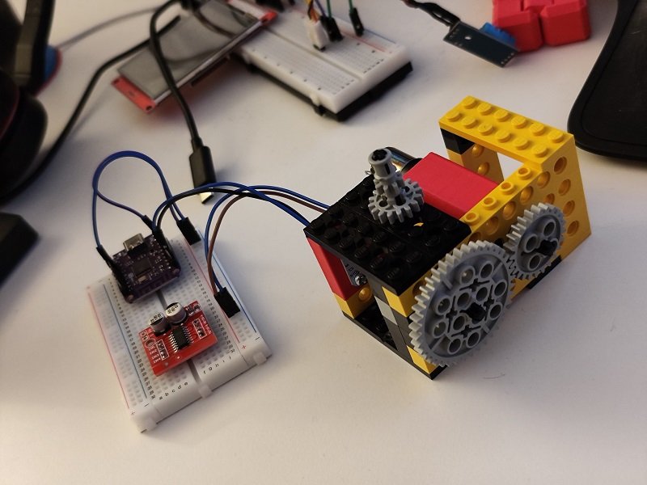

# Welcome to DC Motor and L298N Motorcontroller, AS5600 Rotary Controller with Micropython

[Hardware](#hardware)  
[How it works](#how_it_works)  
[CAD Mounts](#CAD_mounts)  
[TODO](#todo)

# Hardware
- DC Motor
- 3D printing mounts for:
  - AS5600
  - DC Motor
- L298N Motor driver
- AS5600 rotary encoder
- ESP32 S2 mini
- Breadboard + some cables
- 9 V / 12 V power supply for the DC Motor

# How it works

- DC Motor driver as class
- AS5600 class
- Motor controller class
- initial min_duty at the beginning of the program
- set the motor to for example: 50 rpm or 5 rounds then stop
- Motor turn: left / right / stop with speed 100 / -100 / 0

# CAD Mounts

UNDER CONSTRUCTION

# TODO
finish coding  
present some results